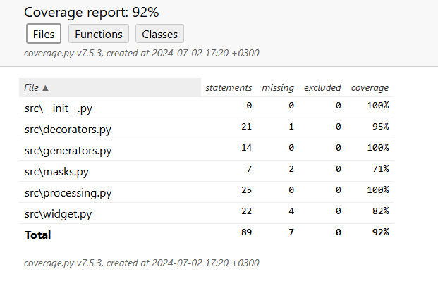

# Разработка на Python
## Домашняя работа №3 (Продвинутый Git), описание:
Пример функции, которая принимает на вход список словарей и значение для ключа 
state и возвращает новый список, содержащий только те словари, у которых ключ 
state содержит переданное в функцию значение.
Пример функции, которая принимает на вход список словарей и возвращает новый список, в котором исходные словари отсортированы по убыванию даты.
## Добавлены тесты:
Для уточнения правильности кода были добавлены тесты(test_masks, test_widget, tests_processing).
## Добавлены генераторы:
Эти генераторы должны позволять финансовым аналитикам быстро и удобно находить нужную информацию о транзакциях и проводить анализ данных.
## Добавлен декоратор "log":
Для проверки работы декоратора нужно заупстить файл main.py.
В зависимости от параметра filename, результаты будут либо в файле mylog.txt, либо в консоли.
## Установка:
1.  Клонируйте репозиторий:
[Github](https://github.com/Alexandr-lab-del/course_2/tree/feature/homework_10_1)
2. Установите зависимости:
pip install -r requirements.txt
## Использование:
1. Откройте проект.
2. Впишите список словарей по типу ['id': 41428829, 'state': 'EXECUTED', 'date': '2019-07-03T18:35:29.512364'].
3. Функции отсортируют их по ключу 'state' и по дате (по возрастанию и убыванию).

