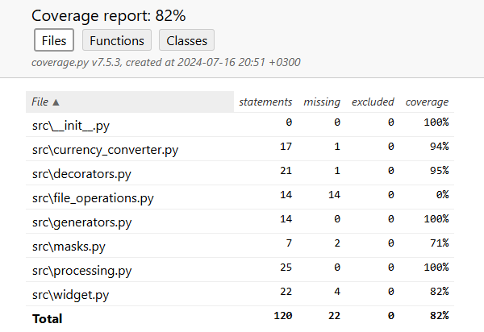

# Разработка на Python
## Домашняя работа №3 (Продвинутый Git), описание:
Пример функции, которая принимает на вход список словарей и значение для ключа 
state и возвращает новый список, содержащий только те словари, у которых ключ 
state содержит переданное в функцию значение.
Пример функции, которая принимает на вход список словарей и возвращает новый список, в котором исходные словари отсортированы по убыванию даты.
## Добавлены тесты:
Для уточнения правильности кода были добавлены тесты(test_masks, test_widget, tests_processing).
## Добавлены генераторы:
Эти генераторы должны позволять финансовым аналитикам быстро и удобно находить нужную информацию о транзакциях и проводить анализ данных.
## Добавлен декоратор "log":
Для проверки работы декоратора нужно заупстить файл main.py.
В зависимости от параметра filename, результаты будут либо в файле mylog.txt, либо в консоли.
# Библиотеки для Python разработчика
## Библиотеки json, requests, datetime, logging, pandas
Функция, которая принимает на вход транзакцию и возвращает сумму транзакции (amount) в рублях, тип данных — float . Если транзакция была в 
USD или EUR, происходит обращение к внешнему API для получения текущего курса валют и конвертации суммы операции в рубли. 
Для конвертации валюты воспользуйтесь Exchange Rates Data API: https://apilayer.com/exchangerates_data-api. 
Созданы  логеры для модулей utils, masks.
## Установка:
1.  Клонируйте репозиторий:
[Github](https://github.com/Alexandr-lab-del/course_2/tree/develop)
2. Установите зависимости:
pip install -r requirements.txt 
pip install python-dotenv
## Использование:
1. Откройте проект.
2. Запустите файл main.py.
# ВАЖНО!!!
При запуске main необходимо прописать путь к файлу с которым он будет работать:
1. Для чтения json файла пропишите "C:\Users\Александр Побережный\Desktop\питон\course_2\data\operations.json"
2. Для чтения csv файла пропишите "C:\Users\Александр Побережный\Desktop\питон\course_2\data\transactions.csv"
3. Для чтения excel файла пропишите "C:\Users\Александр Побережный\Desktop\питон\course_2\data\transactions_excel.xlsx"
# Покрытие тестами

